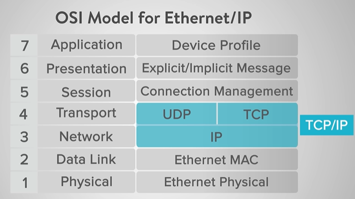
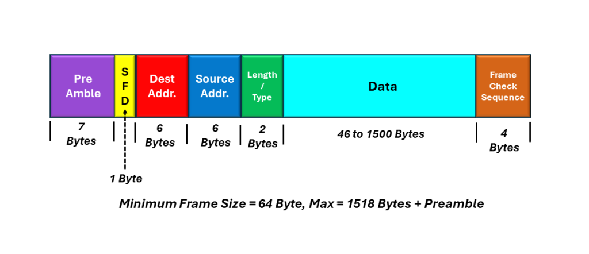

### **Ethernet Introduction**

Ethernet is a widely used networking technology that enables devices to communicate over a local area network (LAN) over IEE 802.3 Standards. It uses a protocol that defines how data packets are formatted and transmitted over the network. Ethernet supports various speeds, including 10 Mbps/10 Gbps (CAT 7), and even higher rates in modern networks.

- `Physical Layer` consists of Cables (Fibre Optics/CAT7) and Devices having (NIC/PCEI) and conncted using bridges (same network) & gateways (different network)
- `Data Link layer` has Logical Link Control (LLC) which establish path for data to transfer between devices and Media Access control (MAC) uses hardware address asignes to NIC's to identify source/destination for data transfer.
  - Use CSMA/CD: Carrier Sense Multiple Access with colision avoidance.

#### Ethernet Packet:

`| Network Header | IP Header | TCP/UDP Header | Appllication Header | Data |`



#### UDP vs TCP

| Feature             | UDP (User Datagram Protocol)                          | TCP (Transmission Control Protocol)                   |
| ------------------- | ----------------------------------------------------- | ----------------------------------------------------- |
| **ACK/NACK**  | No ACK/NACK (best-effort delivery)                    | Uses ACK/NACK for reliable delivery                   |
| **Data Flow** | Continuous, fire-and-forget; lost packets are ignored | Stops/resumes based on ACKs; retransmits lost packets |
| **Speed**     | Faster (no waiting for confirmation)                  | Slower (handshakes & retransmissions add delay)       |
| **Use Cases** | Real-time apps (video, gaming, VoIP)                  | Reliable transfer (web, emails, file downloads)       |

---

#### UDP Packet Structure

Tiny 8-byte header → fast but no reliability

#### TCP Packet Structure

Large, feature-rich header (20–60 bytes) → ensures reliability and ordering.

#### Ethernet Frame

1. **Preamble** is 7 bits alternating 1s and 0s at the beginning of the frame. It helps synchronize the receiving device's clock with the incoming data.
2. **Start Frame Delimiter** (SFD) (1 Byte) marks the end of the preamble and indicates the start of the frame. It's a specific bit sequence (10101011) that signals the beginning of the frame payload.
3. **Type/Length Field** in the Ethernet frame is a 2-byte (16-bit) identifier that specifies the protocol of the payload. Examples of protocols include `IPv4`, `IPv6`, `ARP`, and more.
   In some Ethernet standards, the Length field, also a 2-byte (16-bit) field, specifies the size of the payload in bytes.
4. **Frame Check Sequence** (FCS) (4 Bytes)is a field for error checking. It helps the receiving device identify any errors in the frame during transmission.



---

#### Frames

```bash
 1. `Ethernet Frame Structure`
┌─────────────────┬─────────────────┬─────────────────┬─────────────────┬─────────────────┬────────────────┐
│   Preamble      │   Dest MAC      │   Source MAC    │   EtherType     │   Payload       │   FCS (CRC)    │
│   (8 bytes)     │   (6 bytes)     │   (6 bytes)     │   (2 bytes)     │   (46-1500)     │   (4 bytes)    │
└─────────────────┴─────────────────┴─────────────────┴─────────────────┴─────────────────┴────────────────┘

2. `IP Frame Structure (Inside Ethernet Payload)`
┌─────────────────┬─────────────────┬─────────────────┬─────────────────┬─────────────────┬────────────────┐
│   Version       │   IHL           │   DSCP/ECN      │   Total Length  │   Identification│   Flags/Offset │
│   (4 bits)      │   (4 bits)      │   (8 bits)      │   (16 bits)     │   (16 bits)     │   (16 bits)    │
├─────────────────┼─────────────────┼─────────────────┼─────────────────┼─────────────────┤────────────────│
│   TTL           │   Protocol      │   Header Chksum │   Source IP     │   Dest IP       │    Payload     │
│   (8 bits)      │   (8 bits)      │   (16 bits)     │   (32 bits)     │   (32 bits)     │   (variable)   │
└─────────────────┴─────────────────┴─────────────────┴─────────────────┴─────────────────┴────────────────┘
2.5 `ARP Frame Structure`
┌─────────────────┬─────────────────┬─────────────────┬─────────────────┬─────────────────┬────────────────┐
│   Ethernet      │   ARP Header    │   Hardware      │   Protocol      │   Hardware      │   Protocol     │
│   Header-extra  │   (2 bytes)     │   Type (2)      │   Type (2)      │   Length (1)    │   Length (1)   │
│   (14 bytes)    │   Operation     │   (0x0001)      │   (0x0800)      │   (6 for MAC)   │   (4 for IP)   │
├─────────────────┼─────────────────┼─────────────────┼─────────────────┼─────────────────┤────────────────│
│   Sender MAC    │     Sender IP   │   Target MAC    │    Target IP    │                 │                │
│   (6 bytes)     │     (4 bytes)   │    (6 bytes)    │    (4 bytes)    │                 │                │
└─────────────────┴─────────────────┴─────────────────┴─────────────────┴─────────────────┴────────────────┘
**Field Details:**
- **Hardware Type:** `0x0001` (Ethernet)
- **Protocol Type:** `0x0800` (IPv4)
- **Hardware Length:** `6` (MAC address = 6 bytes)
- **Protocol Length:** `4` (IPv4 address = 4 bytes)
- **Operation:** `0x0001` (Request) or `0x0002` (Reply)
- **Sender MAC/IP:** Who is asking/answering
- **Target MAC/IP:** Who we're looking for

3. `UDP Frame Structure (Inside IP Payload)`
┌─────────────────┬─────────────────┬─────────────────┬─────────────────┐─────────────────┐
│   Source Port   │   Dest Port     │   Length        │   Checksum      │   Payload       │
│   (16 bits)     │   (16 bits)     │   (16 bits)     │   (16 bits)     │   (variable)    │
└─────────────────┴─────────────────┴─────────────────┴─────────────────┴─────────────────┘
```

---

#### Frames Combinations

```bash
PHY LAYER: (wire-level, not a "frame" but actual signals)
┌───────────────────────────────────────────────────────────────────────────┐
│                             PHY SIGNALS                                   │
├─────────────────┬─────────────────┬─────────────────┬─────────────────────┤
│   XGMII / GMII  │   Clocks        │   Control bits  │   Raw bitstream     │
│   (e.g. 64-bit) │   (tx/rx_clk)   │   (valid, err)  │   from/to medium    │
└─────────────────┴─────────────────┴─────────────────┴─────────────────────┘
                                                              ▲
                                                              │
MAC LAYER: (translates PHY signals <-> Ethernet frames)       ▼
┌───────────────────────────────────────────────────────────────────────────┐
│                          ETHERNET MAC FRAME                               │
├─────────────────┬─────────────────┬─────────────────┬─────────────────────┤
│   Preamble+SFD  │   Dest MAC      │   Source MAC    │ EtherType + Payload │
│   (8 bytes)     │   (6 bytes)     │   (6 bytes)     │   (variable)        │
│   + FCS (CRC32) │                 │                 │                     │
└─────────────────┴─────────────────┴─────────────────┴─────────────────────┘
                                                              ▲
                                                              │
ETH LAYER: (Add/Parse Dest MAC, Src MAC, EtherType)           ▼
┌───────────────────────────────────────────────────────────────────────────┐
│                           ETHERNET MAC FRAME                              │
├─────────────────┬─────────────────┬─────────────────┬─────────────────────┤
│   Dest MAC      │   Source MAC    │   EtherType     │   IP Frame          │
│   (6 bytes)     │   (6 bytes)     │   (2 bytes)     │   (variable)        │
└─────────────────┴─────────────────┴─────────────────┴─────────────────────┘
                                                              ▲
                                                              │
IP LAYER: (Add/Parse IP header, verify checksum)              ▼
┌───────────────────────────────────────────────────────────────────────────┐
│                              IP FRAME                                     │
├─────────────────┬─────────────────┬─────────────────┬─────────────────────┤
│   IP Header     │   Version/IHL   │   Source IP     │   UDP Frame         │
│   (20+ bytes)   │   TTL/Protocol  │   Dest IP       │   (variable)        │
└─────────────────┴─────────────────┴─────────────────┴─────────────────────┘
                                                              ▲
                                                              │
UDP LAYER: (Adds/Parse source/dest ports)                     ▼
┌───────────────────────────────────────────────────────────────────────────┐
│                             UDP FRAME                                     │
├─────────────────┬─────────────────┬─────────────────┬─────────────────────┤
│   Source Port   │   Dest Port     │   Length        │   Application       │
│   (2 bytes)     │   (2 bytes)     │   (2 bytes)     │   Data (variable)   │
└─────────────────┴─────────────────┴─────────────────┴─────────────────────┘
                                                              ▲                                                
                                                              │
APPLICATION LAYER: (Encodes/decodes protocols for/from app)   ▼                
┌───────────────────────────────────────────────────────────────────────────┐
│                          APPLICATION PAYLOAD                              │
├───────────────────────────────────────────────────────────────────────────┤
│   (e.g., DNS query, HTTP request, DHCP, custom protocol data)             │
└───────────────────────────────────────────────────────────────────────────┘

```

### Overall Ethernet IP Stack Architecture:

This is a complete Ethernet IP stack written in Verilog that supports:

- 1G (Gigabit) Ethernet with GMII/MII/RGMII interfaces
- 10G/25G Ethernet with XGMII interfaces
- Full protocol stack: Ethernet → IP → UDP → Application
- ARP (Address Resolution Protocol) to find MAC address when IP address is known only by sending broadcast and storing mac address of repondent device in ARP cache memory table by maping IP<-->MAC
- PTP (Precision Time Protocol) for time synchronization

---

#### Signal Flow Architecture:

`RX Path (DUT receiving packets)`
```bash
PHY Layer: Data received in form of Bits from wire (MII/GMII/RGMII/XGMII)
    ↓ MII/GMII/RGMII/XGMII (PHY interfaces)
MAC Layer (eth_mac_*): Converts physical coding (XGMII/GMII) into Ethernet frames (dst_mac, src_mac, ethertype, payload).
    ↓ AXI Stream Interface
Ethernet Frame Parser (eth_axis_rx/eth_axis_tx):Checks EtherType (e.g., ARP = 0x0806, IPv4 = 0x0800).if ARP send to ARP module, if IPv4 send to IP module.
    ↓ Ethernet Frame Interface
UDP Complete Stack (udp_complete)
    ├──IP Complete (ip_complete):Extract IP header, checks If protocol = UDP (17) → pass payload to UDP module.
    |    ├── ARP Module (arp)
    |    ├── IP RX/TX (ip_eth_rx/ip_eth_tx)
    |    └── ARP Cache (arp_cache)
    ├── UDP Module (udp):Extracts UDP header (ports, length, checksum) → delivers final payload to application/testbench.
    c   ├── UDP RX/TX (udp_ip_rx/udp_ip_tx)
    |    └── Checksum Generator (udp_checksum_gen)
    ↓ UDP Frame Interface
Application Logic
```
`TX Path (DUT transmitting packets)`
```bash
├── Application/Testbench → gives payload.
├── UDP Layer → Adds UDP header (ports, checksum).
├── IP Layer → Wraps UDP packet with IP header (src IP, dst IP, protocol=UDP, checksum).
├── Ethernet Layer → Wraps IP packet with Ethernet header (dst_mac, src_mac, ethertype=IPv4).
└── MAC → Converts Ethernet frame to XGMII/GMII signals → PHY → Wire.
```
---

1. **PHY Layer (Physical Layer)**

- It’s the part of Ethernet hardware that actually converts digital data into electrical/optical signals (and back) for transmission over cables.
- Example: The Ethernet jack + chip on an FPGA board is the PHY
- **`MII / GMII / RGMII / XGMII`** (Interfaces):
  These are digital interfaces between your MAC (Media Access Control) logic and the PHY chip.

  - MII (Media Independent Interface): 100 Mbps
  - GMII (Gigabit MII): 1 Gbps
  - RGMII (Reduced GMII): 1 Gbps, but uses fewer pins than GMII
  - XGMII (10 Gigabit MII): 10 Gbps (wider data bus, faster speeds)

2. **MAC Layer** (eth_mac_*)

- Purpose: Converts raw Ethernet signals from the PHY into valid data frames and vice versa.
- Key Features:

  - Handles physical interfaces (MII/GMII/RGMII/XGMII).
  - Checks & generates FCS-frame sequence check (CRC) for frames.
  - Validates frames (good/bad) before passing them on.
  - FIFO buffering to smooth out data flow.
- Interface: Converts PHY signals ↔ AXI Stream (internal standard bus).

  2.1  **AXI Stream Interface**

  A standard streaming bus inside FPGAs used to move data frames between blocks.Every module (UDP → IP → Ethernet → MAC) uses AXI Stream as the standard internal bus for data transfer.

  - Each layer receives AXI Stream data, processes it (adds/removes headers), and outputs AXI Stream data to the next layer.
  - This creates a clean pipeline where UDP adds UDP header to AXI Stream, IP adds IP header to AXI Stream, Ethernet adds Ethernet header to AXI Stream, and MAC converts final AXI Stream to PHY signals.
  - Converts the raw Ethernet frames from the MAC into a clean stream of bytes (tdata, tvalid, tready, tlast) that other modules (Frame Parser, UDP/IP) can easily process.
  - In architecture: MAC outputs data as AXI Stream → Frame Parser reads it as AXI Stream → UDP/IP stack consumes it as AXI Stream.

3. **Ethernet Frame Parser Handle** (eth_axis_rx / eth_axis_tx)

- Acts as an translator/adapter between the MAC & UDP (helper block, not a full OSI layer).
- **RX** (Receive): When data comes in from the MAC AXI-stream , it reads the Ethernet header (Dst/Src MAC, EtherType)(who sent it, who it’s for, what type it is) and then streams just the payload (data) upward.
- **TX** (Transmit): When sending data, it adds the Ethernet header (Dst/Src MAC, EtherType) to the payload before giving it to the MAC.
- Validates basic frame properties (length/runts) and flags bad frames.

4. **UDP Complete Stack** (udp_complete)

- Purpose: Top-level module integrating IP Complete (IP+ARP) and UDP protocol.
  Architecture:

  ```bash
  udp_complete
  ├── udp (UDP protocol)
  |    ├── udp_ip_rx (UDP frame receiver)
  |    ├── udp_ip_tx (UDP frame transmitter)
  |    └── udp_checksum_gen (Checksum calculation)
  └── ip_complete (IP + ARP)
      ├── arp (Address Resolution Protocol)
      ├── arp_cache (MAC address cache)
      ├── ip_eth_rx (IP frame receiver)
      └── ip_eth_tx (IP frame transmitter)

  ```

  4.1  **IP Complete** (ip_complete)

  - Purpose: Manages IPv4 and ARP together.
  - Key Features:
    - Routes IP packets to/from the correct device.
    - Uses ARP to find the MAC address for a given IP.
    - Stores known MAC addresses in the ARP cache.
    - Network configuration

  4.2 **ARP Module** (arp)

  - Purpose: Find a device’s MAC address when only its IP is known.
  - Function:

    - Sends ARP requests (Who has IP X?).
    - Handles ARP replies (I am IP X, here’s my MAC).
    - Updates ARP cache (A small table memroy mapping IP (hash) ↔ MAC addresses (data)  using hash tables) to avoid sending request everytime. When an ARP request comes in, it first checks the cache.If the IP is found in cache, it returns the MAC immediately
    - When IP not in cache, it sends broadcast ARP request to FF:FF:FF:FF:FF:FF (broadcast MAC) to DUT. Test sends ARP request asking "What's the MAC for IP 192.168.1.101?"
      - DUT sees this IP matches its own local_ip, so it responds with its MAC as `arp reply`.
      - rx_pkt[Ether].src = MAC address that DUT actually sent in response
      - local_mac = MAC address we configured DUT to use
      - assert checks if DUT used the correct MAC we configured it with
    - When any ARP frame arrives, it automatically stores the sender's info.
    - Removes old/expired entries after a timeout.

  4.3 **IP RX/TX** (ip_eth_rx, ip_eth_tx)

  - Purpose: Receive and send IP packets.
    - RX: Strips IP headers and sends payload up.
    - TX: Adds IP headers and sends packets down to the MAC.

  4.4 **UDP Module** (udp)

  - Purpose: Implements UDP protocol over IP.
    - udp_ip_rx: Reads UDP headers, extracts payload, and passes it to user logic.
    - udp_ip_tx: Builds UDP headers and sends payload down to IP layer.
    - udp_checksum_gen: Generates/validates the UDP checksum for error checking.
- `Gateway` is the IP address of a device (like a router) that connects your local network to other networks (e.g., the internet).
- `Subnet` defines the range of IP addresses within your local network, controlled by a subnet mask (e.g., 255.255.255.0 means devices must match in the first 3 parts to be considered in the same network).

#### Key Interfaces & Signal Flows

1. AXI Stream Interface (Universal)

```sv
// Common AXI Stream signals used between ALL modules
input  wire [7:0]  tdata,    // Data bytes
input  wire        tvalid,    // Data valid
output wire        tready,    // Sink ready (backpressure)
input  wire        tlast,     // End of frame
input  wire        tuser      // Bad frame indicator
```

2. Ethernet Frame Interface

```sv
// Header interface (parallel)
input  wire        hdr_valid,     // Header valid
output wire        hdr_ready,     // Header ready
input  wire [47:0] dest_mac,      // Destination MAC
input  wire [47:0] src_mac,       // Source MAC  
input  wire [15:0] eth_type,      // EtherType

// Payload interface (AXI Stream)
input  wire [7:0]  payload_tdata,  // Payload data
input  wire        payload_tvalid, // Payload valid
output wire        payload_tready, // Payload ready
input  wire        payload_tlast,  // Payload end
input  wire        payload_tuser   // Payload error
```

3. IP Frame Interface

```sv
// IP header fields
input  wire [31:0] source_ip,     // Source IP address
input  wire [31:0] dest_ip,       // Destination IP address
input  wire [7:0]  ttl,           // Time to live
input  wire [7:0]  protocol,      // Protocol (17 for UDP)
input  wire [15:0] length,        // Total length
input  wire [5:0]  dscp,          // Differentiated Services
input  wire [1:0]  ecn,           // Explicit Congestion Notification
// +  payload AXI stream (IP payload)
```

4. UDP Frame Interface

```sv
// UDP header fields
input  wire [15:0] source_port,   // Source port
input  wire [15:0] dest_port,     // Destination port
input  wire [15:0] length,        // UDP length
input  wire [15:0] checksum,      // UDP checksum
// + payload AXI stream (UDP payload)
```

#### Data Flow btw Networking Layers

`Transmit Path` (Outgoing Packet)

```bash
Application Data (Payload)
    ↓
UDP Module (udp_ip_tx)
├── Adds UDP Header (Source Port, Dest Port, Length, Checksum)
├── UDP Frame = UDP Header + Application Payload
    ↓
IP Module (ip_eth_tx)
├── Adds IP Header (Source IP, Dest IP, TTL, Protocol=17, etc.)
├── IP Frame = IP Header + UDP Frame
    ↓
Ethernet Module (eth_axis_tx)
├── Adds Ethernet Header (Dest MAC, Source MAC, EtherType=0x0800)
├── Ethernet Frame = Ethernet Header + IP Frame + FCS
    ↓
MAC Module (eth_mac_*)
├── Converts to AXI Stream format
├── Adds FCS (Frame Check Sequence)
├── Handles padding to minimum frame size
    ↓
PHY Interface (GMII/MII/RGMII)
├── Converts to digital signals
├── Adds preamble and start frame delimiter
```

`Receive Path` (Incoming Packet)

```bash
PHY Digital Signals
    ↓XGMII
MAC Module (eth_mac_*)
├── Removes preamble, validates FCS
├── Converts to AXI Stream
    ↓
Ethernet Parser (eth_axis_rx)
├── Parses Ethernet header (MAC addresses, EtherType)
├── Extracts IP frame from payload
    ↓
IP Module (ip_eth_rx)
├── Parses IP header (addresses, protocol)
├── Extracts UDP frame from payload
    ↓
UDP Module (udp_ip_rx)
├── Parses UDP header (ports, length)
├── Extracts application payload
    ↓
Application Logic
```

#### Config's & Parameters

- Network Configuration :(Data width define, Define cache size,Timeout settings )
  ```sv
  wire [47:0] local_mac   = 48'h02_00_00_00_00_00; // 6bytes
  wire [31:0] local_ip    = {8'd192, 8'd168, 8'd1,   8'd128}; // 4bytes: 192.168.1.128 //Device IP address on network
  wire [31:0] gateway_ip  = {8'd192, 8'd168, 8'd1,   8'd1}; // Router's IP address
  wire [31:0] subnet_mask = {8'd255, 8'd255, 8'd255, 8'd0}; //Defines which part of IP is network vs host
  //Format: 255.255.255.0 (4 bytes)
  //Purpose:
    //255 = Network part (keep)
    //0 = Host part (ignore)
    //Example: 192.168.1.128 with mask 255.255.255.0 means network is 192.168.1.0
  // Status signals (dynamic)
  output wire        busy,           // Module busy
  output wire        error_*,        // Various error conditions
  ```
- Module Parameters
  ```sv
  // ARP Configuration
  parameter ARP_CACHE_ADDR_WIDTH = 9,
  parameter ARP_REQUEST_RETRY_COUNT = 4,
  parameter ARP_REQUEST_TIMEOUT = 125000000*30,

  // FIFO Configuration
  parameter TX_FIFO_DEPTH = 4096,
  parameter RX_FIFO_DEPTH = 4096,

  // Checksum Configuration
  parameter UDP_CHECKSUM_GEN_ENABLE = 1
  ```

---

### Complete Ethernet IP Stack diagram

```bash
                          ┌────────────────────────────────────────┐
                          │           APPLICATION LAYER            │
                          │          ┌─────────────────┐           │
                          │          │   Application   │           │
                          │          │   Logic (UDP    │           │
                          │          │   Echo Server)  │           │
                          │          │   `fpga_core.v` │           │
                          │          │ • UDP Echo      │           │
                          │          │   Server        │           │
                          │          │ • Port 1234     │           │
                          │          │ • LED Display   │           │
                          │          │ • Loop Back     │           │
                          │          └─────────────────┘           │
                          └────────────────────────────────────────┘
                                              │
                                              ▼
┌─────────────────────────────────────────────────────────────────────────────────────────────────┐
│                                    UDP COMPLETE STACK                                           │
│  ┌─────────────────────────────────────────────────────────────────────────────────────────────┐│
│  │                                    udp_complete                                             ││ 
│  │                                                                                |            ││
│  │  ┌─────────────────┐                           ┌─────────────────┐                          ││
│  │  │   UDP Input     │                           │   IP Input      │                          ││
│  │  │   Interface     │                           │   Interface     │                          ││
│  │  │                 │                           │                 │                          ││
│  │  │ s_udp_hdr_valid │                           │ s_ip_hdr_valid  │                          ││
│  │  │s_udp_source_port│                           │ s_ip_dscp       │                          ││
│  │  │s_udp_dest_port  │                           │ s_ip_ttl        │                          ││
│  │  │ s_udp_length    │                           │ s_ip_protocol   │                          ││
│  │  │ s_udp_checksum  │                           │ s_ip_source_ip  │                          ││
│  │  │ s_udp_payload_* │                           │ s_ip_dest_ip    │                          ││
│  │  └─────────────────┘                           │ s_ip_payload_*  │                          ││
│  │           │                                    └─────────────────┘                          ││
│  │           ▼                                            │                                    ││
│  │  ┌─────────────────┐                                   │                                    ││
│  │  │      UDP        │                                   │                                    ││
│  │  │   (udp.v)       │                                   │                                    ││
│  │  │                 │                                   │                                    ││
│  │  │ • udp_ip_rx     │                                   │                                    ││
│  │  │ • udp_ip_tx     │                                   │                                    ││
│  │  │•udp_checksum_gen|                                   │                                    ││
│  │  └─────────────────┘                                   |                                  
              │                                             |
              ▼   
     ┌─────────────────┐
     │   UDP Output    │
     │   Interface     │
     │                 │
     │ m_udp_hdr_valid │
     │m_udp_source_port│
     │m_udp_dest_port  │
     │ m_udp_length    │
     │ m_udp_checksum  │
     │ m_udp_payload_* │
     │• udp_tx_ip_*    │
     └|────────────────┘
      |       │    
      |       ▼                                            │                                     ││
│  │  |───────|────────────────────────────────────────────│                                     ││
│  │           ▼                                                                                 ││
│  │  ┌─────────────────┐                                                                        ││
│  │  │   IP ARB MUX    │                                                                        ││
│  │  │ (ip_arb_mux.v)  │                                                                        ││
│  │  │                 │                                                                        ││
│  │  │ • Priority      │                                                                        ││
│  │  │   arbitration   │                                                                        ││
│  │  │ • Round-robin   │                                                                        ││
│  │  │   scheduling    │                                                                        ││
│  │  │ • Flow control  │                                                                        ││
│  │  └─────────────────┘                                                                        ││
│  │           │                                                                                 ││
│  │           ▼                                                                                 ││
│  │  ┌─────────────────┐                                                                        ││
│  │  │   IP COMPLETE   │                                                                        ││
│  │  │ (ip_complete.v) │                                                                        ││
│  │  │                 │                                                                        ││
│  │  │ • arp           │                                                                        ││
│  │  │ • arp_cache     │                                                                        ││
│  │  │ • ip_eth_rx     │                                                                        ││
│  │  │ • ip_eth_tx     │                                                                        ││
│  │  └─────────────────┘                                                                        ││
│  │           │                                                                                 ││
│  │           ▼                                                                                 ││
│  │  ┌─────────────────┐                                                                        ││
│  │  │   ARP MODULE    │                                                                        ││
│  │  │   (arp.v)       │                                                                        ││
│  │  │                 │                                                                        ││
│  │  │ • ARP requests  │                                                                        ││
│  │  │ • ARP replies   │                                                                        ││
│  │  │ • Cache updates │                                                                        ││
│  │  │•Timeout handling│                                                                        ││
│  │  └─────────────────┘                                                                        ││
│  │           │                                                                                 ││
│  │           ▼                                                                                 ││
│  │  ┌─────────────────┐                                                                        ││
│  │  │   ARP CACHE     │                                                                        ││
│  │  │ (arp_cache.v)   │                                                                        ││
│  │  │ • MAC address   │                                                                        ││
│  │  │   storage       │                                                                        ││
│  │  │ • LRU eviction  │                                                                        ││
│  │  │ • Hash lookup   │                                                                        ││
│  │  │ • Entry aging   │                                                                        ││
│  │  │                 │                                                                        ││
│  │  └─────────────────┘  
              │                                                                       
              ▼ 
     ┌─────────────────┐ 
     │   IP Output     │ 
     │   Interface     │ 
     │                 │ 
     │ m_ip_hdr_valid  │ 
     │m_ip_eth_dest_mac│ 
     │ m_ip_eth_src_mac│ 
     │ m_ip_eth_type   │ 
     │ m_ip_version    │ 
     │ m_ip_dscp       │ 
     │ m_ip_length     │ 
     │ m_ip_ttl        │ 
     │ m_ip_protocol   │ 
     │ m_ip_source_ip  │ 
     │ m_ip_dest_ip    │ 
     │ m_ip_payload_*  │ 
     └─────────────────┘ 
           │                                                                       
           ▼                                                                                     ││
│  └─────────────────────────────────────────────────────────────────────────────────────────────┘│
└─────────────────────────────────────────────────────────────────────────────────────────────────┘
                                                     │
                                                     ▼
                             ┌─────────────────────────────────────────────┐
                             │          ETHERNET FRAME PARSER              │
                             │  ┌─────────────────┐    ┌─────────────────┐ │
                             │  │   ETH AXIS RX   │    │   ETH AXIS TX   │ │
                             │  │ (eth_axis_rx.v) │    │ (eth_axis_tx.v) │ │
                             │  │AXI->Eth. Frame  │    │ Eth. Frame->AXI │ │
                             │  │ • Ethernet      │    │ • Ethernet      │ │
                             │  │   header        │    │   header        │ │
                             │  │   parsing       │    │   generation    │ │
                             │  │ • MAC address   │    │ • MAC address   │ │
                             │  │   extraction    │    │   insertion     │ │
                             │  │ • EtherType     │    │ • EtherType     │ │
                             │  │   validation    │    │   assignment    │ │
                             │  │ • Payload       │    │ • Payload       │ │
                             │  │   extraction    │    │   insertion     │ │
                             │  └─────────────────┘    └─────────────────┘ │
                             └─────────────────────────────────────────────┘
                                                     │
                                                     ▼
                            ┌────────────────────────────────────────────────┐
                            │                     MAC LAYER                  │
                            │  ┌───────────────────┐    ┌──────────────────┐ │
                            │  │   ETH MAC MII     │    │   ETH MAC MII    │ │
                            │  │   FIFO (RX)       │    │   FIFO (TX)      │ │
                            │  │eth_mac_mii_fifo.v │    │eth_mac_mii_fifo.v│ │
                            │  │                   │    │                  │ │
                            │  │ • FCS validation  │    │ • FCS generation │ │
                            │  │ • Frame           │    │ • Frame          │ │
                            │  │   validation      │    │   padding        │ │
                            │  │ • FIFO            │    │ • FIFO           │ │
                            │  │   buffering       │    │   buffering      │ │
                            │  │ • Clock domain    │    │ • Clock domain   │ │
                            │  │   crossing        │    │   crossing       │ │
                            │  │ • AXI Stream      │    │ • AXI Stream     │ │
                            │  │   conversion      │    │   conversion     │ │
                            │  └───────────────────┘    └──────────────────┘ │
                            └────────────────────────────────────────────────┘
                                                      │
                                                      ▼
                              ┌─────────────────────────────────────────────┐
                              │                   PHY Interface             │
                              │  ┌─────────────────┐    ┌─────────────────┐ │
                              │  │   MII/GMII/RGMII│    │   MII/GMII/RGMII│ │
                              │  │   Interface     │    │   Interface     │ │
                              │  │                 │    │                 │ │
                              │  │ • mii_rx_clk    │    │ • mii_tx_clk    │ │
                              │  │ • mii_rxd[3:0]  │    │ • mii_txd[3:0]  │ │
                              │  │ • mii_rx_dv     │    │ • mii_tx_en     │ │
                              │  │ • mii_rx_er     │    │ • mii_tx_er     │ │
                              │  │ • mii_col       │    │                 │ │
                              │  │ • mii_crs       │    │                 │ │
                              │  └─────────────────┘    └─────────────────┘ │
                              └─────────────────────────────────────────────┘

```

```bash
|UDP module IP|              |Input Interface|
     |                              |
     ▼                              |
|UDP Module|                        |
     |                              |
     ▼                              |
|UDP Output Interface|              |
| udp_tx_ip_*        |              |
     |                              |
     ▼                              ▼
   ──────────────────────────────────────────
       IP Arb Mux
   ──────────────────────────────────────────
            |
            ▼
      |IP Complete|
            |
            ▼
 |IP Output Interface|    
```
### EtherType Values
- `0x0800` - IPv4
- `0x0806` - ARP
- `0x86DD` - IPv6
- `0x8100` - VLAN tagged frame

### IP Protocol Values  
- `0x01` - ICMP
- `0x06` - TCP
- `0x11` - UDP
- `0x84` - SCTP

### Common UDP Ports
- `53` - DNS
- `67/68` - DHCP
- `69` - TFTP
- `123` - NTP
- `161/162` - SNMP
- `514` - Syslog
- `520` - RIP
- `2049` - NFS

---

Core Libraries:
`scapy`: Network packet manipulation (create/send/receive packets). Creates ARP packets for testing, parses responses.
`cocotb`: Hardware verification framework for testing RTL designs.  Connects Python test to Verilog DUT, handles clock/reset, manages test flow
`pytest`: Python testing framework for running test cases

Technical Components:
`AxiStreamBus`: AXI Stream protocol interface for data transfer. Transfers packet data between test and DUT
`define_stream`: Creates custom bus interfaces for specific protocols
`EthHdrBus/ArpReqBus/ArpRespBus`: Custom bus definitions for Ethernet headers, ARP requests, and ARP responses. Custom buses: Handle specific protocol signals (valid/ready handshaking, data fields).

---
### Scappy
A Python library for packet manipulation and network testing. It lets you create, send, receive, and analyze network packets at a low level for Ether, ARP.


TB class initializes test environment with clock, sources/sinks for data transfer
- TestBench Methods
    - set_idle_generator: Controls timing of packet transmission
    - set_backpressure_generator: Controls flow control
    - reset: Resets DUT and waits for stable state
- `Packet Handling`
    - send(): Converts Scapy packet to AXI Stream format and sends to DUT
    - recv(): Receives AXI Stream data from DUT and converts back to Scapy packet format

#### XGMII
- axis_xgmii_rx_64.v: : Converts XGMII (10G Media Independent Interface) data to AXI Stream format for processing. high-speed data format that carries both data and control information in 64-bit chunks.(MAC Layer → Application)
  - 1. Control Character Detection: Detects XGMII_START (0xFB) and XGMII_TERM (0xFD) to identify packet boundaries. control signal is nedded to start/stop and put in idle phase.
  - 2. Lane Swapping: Different hardware vendors implement XGMII with different byte ordering (little-endian vs big-endian). Automatically handles different byte orders by detecting start characters in different positions and swapping lanes accordingly. 
  - 3. State Machine: Three states (IDLE → PAYLOAD → LAST) to process packets from start to finish.
  - 4. Data Masking: Uses control bits to mask out control characters, keeping only actual packet data for AXI Stream output.
  - 5. CRC Validation: Calculates and validates packet CRC to detect transmission errors and set error flags.
  - 6. PTP Timestamping: Captures precise timestamps when packets start for time-sensitive applications.
  - 7. AXI Stream Conversion: Converts XGMII format (data + control) to standard AXI Stream format (just data with valid/last signals)

- axis_xgmii_tx_64.v: converts AXI Stream data back to XGMII format for transmission. (Application → MAC Layer)
   - Takes AXI Stream data as input
   - Converts to XGMII format (adds control characters)
   - Handles packet boundaries and idle periods
   - Manages lane swapping for different XGMII implementations


- rtl/eth_mac_10g.v
 Complete 10G Ethernet MAC that coordinates XGMII TX/RX modules and provides full Ethernet functionality.

1. Receive: XGMII → RX Module → AXI Stream → Application
  - XGMII: Network sends 64-bit data + control characters (START/TERM)
  - RX Module: Detects START, extracts data, validates CRC, converts to AXI Stream
  - AXI Stream: Standard format with valid/last signals for easy processing
  - Application: Receives clean packet data ready for higher-layer processing
2. Transmit: Application → AXI Stream → TX Module → XGMII
  - Application: Sends packet data in AXI Stream format
  - AXI Stream: Provides data with valid/last signals and user flags
  - TX Module: Adds START character, calculates CRC, adds TERM character
  - XGMII: Transmits 64-bit data + control characters to network
3. Flow Control: Manages packet flow to prevent buffer overflow
  - LFC: Sends PAUSE frames when receive buffer is full
  - PFC: Priority-based flow control for different traffic classes
  - Pause: Temporarily stops transmission to allow buffer recovery
4. Error Handling: Detects and reports transmission errors
  - Bad Frame: Detects malformed packets and sets error flags
  - Bad FCS: CRC validation fails, marks packet as corrupted
  - Underflow: TX buffer empty, can't transmit when requested
5. Statistics: Tracks performance metrics
  - Packet Counts: Number of packets transmitted/received
  - Error Rates: Bad frames, CRC errors, underflow events
  - Flow Control: PAUSE/PFC frame counts and timing

- test_eth_mac_10g.py
1. Imports and Setup
- Imports cocotb (for testbench), Scapy (for packet creation), and AXI Stream helpers.
- Sets up the test environment and logging.
2. Testbench Class
- Initializes the DUT (Device Under Test) and connects AXI Stream sources/sinks to the MAC’s TX and RX ports.
- Handles clock, reset, and configuration of the MAC (e.g., enabling/disabling features).
3. Packet Creation and Injection
- Uses Scapy to build Ethernet frames (with custom MAC addresses, payloads, etc.).
- Sends these frames into the MAC’s transmit (TX) interface using AXI Stream.
4. Packet Reception and Validation
- Receives frames from the MAC’s receive (RX) interface.
- Compares received frames to expected results (checks MAC addresses, payload, CRC, etc.).
- Uses assertions to ensure the MAC behaves as expected.
5. Error and Flow Control Testing
- Simulates error conditions (e.g., bad CRC, underflow) and checks if the MAC sets the correct error flags.
- Tests flow control by simulating buffer full conditions and verifying PAUSE frame handling.
6. Statistics and Status
- Reads and checks MAC status outputs (packet counters, error counters, flow control stats).
- Ensures the MAC reports correct statistics for all tested scenarios.


---


How Data Flows:

- Testbench creates UDP/IP/Ethernet packet → converts to XGMII frame → sends to DUT via XgmiiSource.
- DUT receives frame, processes through MAC, ARP, IP, UDP modules.
- If ARP needed, DUT sends ARP request out SFP port, testbench receives and validates.
- Testbench sends ARP reply, DUT updates ARP cache.
- DUT forwards UDP packet, testbench receives via XgmiiSink and validates all fields.

---

Test: test_fpga_core_eth25g.py:
Full Ethernet/IP/ARP Flow (Testbench ↔ DUT ↔ Testbench)
1. Testbench (TB) sends a UDP/IP packet:
  - “Hi DUT, here's a packet for IP 192.168.1.128. You should forward it.”

2. DUT receives the Ethernet frame and says:
  - “This frame is for me (MAC matches). Let me check the IP…”

3.  DUT sees the packet is not for itself, but for 192.168.1.128.
  - “I don’t know the MAC for that IP!”

4. DUT broadcasts an ARP request:
  - “Who has IP 192.168.1.128? Please tell me your MAC — reply to me at 02:00:00:00:00:00.”

5.  Testbench receives the ARP request and replies:
  - “That IP is mine! My MAC is 5a:51:52:53:54:55.”

6.  DUT receives the ARP reply and updates its ARP table:
  - “Got it. Now I know how to reach 192.168.1.128!”

7.  DUT builds a new Ethernet frame with:

 - dst MAC = 5a:51:52:53:54:55
 - src MAC = 02:00:00:00:00:00
  and forwards the original UDP packet.

Testbench receives the forwarded packet and verifies it:
“ Nice! The DUT properly resolved ARP and forwarded the data to me.”

---

### Process
1. DPI-C (Direct Programming Interface): SystemVerilog calls C functions directly using import "DPI-C" declarations, allowing seamless integration between HDL and C code.
2. Python C API: C wrapper uses Python's C API (PyObject, PyImport_ImportModule, PyObject_CallObject) to call Python functions from C, enabling access to Scapy's packet manipulation capabilities.
3. Memory Management: C layer handles conversion between Python byte arrays, C arrays, and SystemVerilog byte arrays, ensuring proper memory allocation/deallocation across language boundaries.
4. Protocol Stack Integration: Each layer (Python→C→SystemVerilog) maintains packet integrity while adding protocol-specific functionality (XGMII framing, ARP resolution, UVM compatibility).
5. UVM Framework Integration: SystemVerilog layer provides standard UVM components (driver, monitor, sequence) that use the C wrapper functions, maintaining industry-standard verification methodology while leveraging Python's networking capabilities.


---

1. Wsl in Window with ubuntu 22.04

```bash
# Update package list
sudo apt update

# Install GCC and build tools
sudo apt install gcc g++ make build-essential
# Install Python development headers (for Python C API)
sudo apt install python3-dev
# Verify installation
gcc --version
g++ --version

# Install additional development tools
sudo apt install cmake pkg-config
# Install Python packages
pip3 install scapy cocotb
# Install git (if not already installed)
sudo apt install git

# Test Python
python3 -c "import scapy; print('Scapy OK')"

# Test C compiler
echo '#include <stdio.h>
int main() { printf("GCC OK\n"); return 0; }' > test.c
gcc test.c -o test
./test

# Test Python C API
python3 -c "
import ctypes
import sys
print('Python C API available')

```

---

#### C Wrapper Flow for Python

1. Py_Initialize()
   Initializes the embedded Python runtime environment inside your C program.
   ➤ It sets up Python's memory space, interpreter state, and imports system modules.
2. PyImport_Import()
   Dynamically loads a Python module (.py file) as a Python object into C.
   ➤ It gives you a handle to access Python functions and variables from that file.
3. PyObject_CallObject()
   Calls a Python callable (function, method, etc.) from C with specified arguments (as PyObject*).
   ➤ It executes the function and returns the result as a PyObject*.
4. PyLong_AsLong()
   Converts a Python object (like an integer) returned from a function into a native C type (e.g., long).
   ➤ It’s used for extracting primitive values from Python to use in C logic.
5. Py_Finalize()
   Shuts down the Python interpreter and releases all allocated Python resources.
   ➤ It cleans up memory and safely ends Python usage in the C context

Example Code: Write a Python file with a function.
  Write a C file that:

- Initializes Python,
- Loads the Python function,
- Sends input,
- Gets output,
- Cleans up.

```py
# packet_utils.py (same folder)

def add_numbers(a, b):
    return a + b
```

```c
// main.c
#include <Python.h>
#include <stdio.h>

int main() {
    // 1. Initialize the Python interpreter
    Py_Initialize();

    // 2. Import the Python module (packet_utils.py → packet_utils)
    PyObject *pName = PyUnicode_DecodeFSDefault("packet_utils");
    PyObject *pModule = PyImport_Import(pName);
    Py_DECREF(pName); // cleanup

    if (pModule != NULL) {
        // 3. Get the reference to the function "add_numbers"
        PyObject *pFunc = PyObject_GetAttrString(pModule, "add_numbers");

        if (pFunc && PyCallable_Check(pFunc)) {
            // 4. Prepare the 2 arguments to send (e.g., add_numbers(5, 7))
            PyObject *pArgs = PyTuple_Pack(2, PyLong_FromLong(5), PyLong_FromLong(7));

            // 5. Call the function
            PyObject *pValue = PyObject_CallObject(pFunc, pArgs);
            Py_DECREF(pArgs); // cleanup

            if (pValue != NULL) {
                long result = PyLong_AsLong(pValue);
                printf("Result from Python: %ld\n", result);
                Py_DECREF(pValue);
            } else {
                PyErr_Print();
                fprintf(stderr, "Function call failed\n");
            }
            Py_XDECREF(pFunc);
        } else {
            PyErr_Print();
            fprintf(stderr, "Cannot find function 'add_numbers'\n");
        }
        Py_DECREF(pModule);
    } else {
        PyErr_Print();
        fprintf(stderr, "Failed to load 'packet_utils'\n");
    }
    // 6. Finalize Python interpreter
    Py_Finalize();

    return 0;
}

```

```bash
gcc main.c -I/usr/include/python3.*/ -lpython3.* -o main # replace * with installed version
```

```bash
./main run it
```


-----------------
#### rtl/udp_complete_64.v, tb/test_udp_complete_64.py/sv
1. Testbench uses MyHDL (Python) -(creates test stimuli and verifies DUT outputs.) for simulation, co-simulating with Verilog via Icarus Verilog (vvp).
2. Compiles Verilog sources (DUT: udp_complete_64.v, dependencies like udp_64.v) into vvp executable (simulates the udp_complete_64 design for co-simulation with MyHDL.).
3. Parameters configure ARP cache, retries, timeouts, and UDP checksum features.
4. Signals defined for clock, reset, Ethernet/IP/UDP headers, payloads, and status.
5. Sources (senders) are created using custom classes: EthFrameSource, IPFrameSource, UDPFrameSource create input frames.
6. EthFrameSink, IPFrameSink, UDPFrameSink capture and verify outputs.
7. Source/sink logic handles AXI-stream (tdata, tkeep, tvalid, tready).
8. DUT instantiated as Cosimulation, linking Python signals to Verilog vvp.
9. Clock generator toggles clk every 4 time units.
10. Error monitors latch status signals (e.g., ip_rx_error_*) for assertions.
11. wait_normal ensures idle periods when no valid signals are active.
12. check instance resets DUT, sets local MAC/IP, gateway, subnet mask.
13. Test 1: Sends IP Ethernet frame, verifies match on IP sink.
14. Test 2: Sends IP frame, triggers ARP, responds, verifies Ethernet frame.
15. Test 3: Sends IP to unknown IP, checks ARP failure and error assertion.
16. Test 4: Sends UDP Ethernet frame, verifies match on UDP sink.
17. Test 5: Sends UDP frame, verifies Ethernet frame (implicit ARP if needed).
18. Asserts empty queues and no unexpected frames/errors.
19. Simulation ends with StopSimulation; test_bench() runs full test.
20. Verilog testbench bridges MyHDL to DUT, uses $from_myhdl/$to_myhdl, dumps waveforms.