## DLL (Dynamic Link Library) Concept use case 

1.  write C/C++ functions (like `call_create_arp_frame`) and mark them with  `extern "C" __declspec(dllexport)` so they can be found outside the code.

2. You compile those functions into a DLL using cl (MSVC compiler).
3. The DLL is just a file containing machine code + an “export table” listing available functions.
4. SystemVerilog DPI knows about these functions because we declare them in SV with
`import "DPI-C" function ...;`
5. When the simulation starts, the simulator (like QuestaSim) loads your DLL into memory.
The SV calls get redirected into your C/C++ code inside the DLL which executes by remianing inside dll.
6. Your C/C++ code runs, does whatever it needs (call Python, process bytes, etc.) by being inside dll,
and returns results back to SystemVerilog.


## Python C API Memory Management
When you work with the Python C API, things like modules, functions, strings, and tuples are all Python objects managed by the Python interpreter.
These objects live on Python’s own heap memory, not in your C stack.
C code doesn’t copy them — instead, it uses a PyObject* pointer as a handle to reference and manipulate them.
If an operation fails, the pointer is NULL; if it succeeds, you manage its lifetime with reference counting (Py_DECREF/Py_INCREF).


#### ARP

 `ARP Frame Structure` (28 Octect ARP request/reply) starting from ARP header-operation till Target IP
 ```bash
┌─────────────────┬─────────────────┬─────────────────┬─────────────────┬─────────────────┬────────────────┐
│Ethernet Header  │  ARP Header     │   Hardware      │   Protocol      │   Hardware      │   Protocol     │
│-extra           │   (2 bytes)     │   Type (2)      │   Type (2)      │   Length (1)    │   Length (1)   │
│   (14 bytes)    │   Operation     │   (0x0001)      │   (0x0800)      │   (6 for MAC)   │   (4 for IP)   │
├─────────────────┼─────────────────┼─────────────────┼─────────────────┼─────────────────┤────────────────│
│   Sender MAC    │     Sender IP   │   Target MAC    │    Target IP    │                 │                │
│   (6 bytes)     │     (4 bytes)   │    (6 bytes)    │    (4 bytes)    │                 │                │
└─────────────────┴─────────────────┴─────────────────┴─────────────────┴─────────────────┴────────────────┘
```

**Field Details:**
- **Ethernet Header:** Contains source (6 byte) and destination (6 bytes) MAC addresses, Ether frametype (2 bytes), etc.
- **Operation:** `0x0001` (Request) or `0x0002` (Reply)
- **Hardware Type:** `0x0001` (Ethernet)
- **Protocol Type:** `0x0800` (IPv4)
- **Hardware Length:** `6` (MAC address = 6 bytes)
- **Protocol Length:** `4` (IPv4 address = 4 bytes)
- **Sender MAC/IP:** Who is asking/answering
- **Target MAC/IP:** Who we're looking for
- 


---
#### C Wrapper Flow for Python

1. Py_Initialize():Start the Python Engine
   Initializes the embedded Python runtime environment inside your C program.
   ➤ It sets up Python's memory space, interpreter (python3, python) state, and imports system modules.
2. PyImport_Import():Load the module/.py file
   Dynamically loads a Python module (.py file) as a PyObject (a C-friendly Python Object) into C.
   ➤ It gives you a handle to access Python functions and variables from that file.
3. PyObject_CallObject():Call a Python function
   Calls a Python callable (function, method, etc.) from C with specified arguments (as PyObject*).
   ➤ It executes the function and returns the result as a PyObject*.
4. PyLong_AsLong():Convert  result from Python int to C long format to use in C.
   Converts a Python object (like an integer) returned from a function into a native C type (e.g., long).
   ➤ It’s used for extracting primitive values from Python to use in C logic.
5. Py_Finalize():Shuts down the Python interpreter
   Shuts down the Python interpreter and releases all allocated Python resources.
   ➤ It cleans up memory and safely ends Python usage in the C context

---
### Flowchart

---
### UML Sequence Diagram

```mermaid
%%{init: {'theme': 'base', 'themeVariables': { 'primaryColor': '#e1f5fe', 'secondaryColor': '#ffd8d8'}}}%%
sequenceDiagram
    participant SV as 🔵 SystemVerilog ()
    participant C as 🟢 C Wrapper 
    participant PY as 🔴 Python

    Note over SV: Step 1: Initiate Call
    SV->>C: arp_frame(arp_data, src_mac, ...)
    activate C

    Note over C: Step 2: Convert Types
    C->>C: PyUnicode_FromString(src_mac)
    
    Note over C: Step 3: Call Python
    C->>PY: create_arp_frame(src_mac, src_ip)
    activate PY

    Note over PY: Step 4: Build Packet
    PY->>PY: Ether()/ARP()
    
    Note over PY: Step 5: Return Bytes
    PY-->>C: [0xff, 0x08, ...]
    deactivate PY

    Note over C: Step 6: Copy to SV
    C->>C: svWriteToArray(arp_data)
    C-->>SV: Updated arp_len
    deactivate C

    Note over SV: Step 7: Parse
    SV->>SV: ARP.parse(arp_data)

```



---
#### Using Visual Studio 2022 Developer Cmd Prompt in VScode
- Update Setting.json in vs code by pressing `Ctrl+shift+p` and searching for "Preferences: Open Settings (JSON)":
```json
{
    "files.autoSave": "afterDelay",
    "github.copilot.nextEditSuggestions.enabled": true,
    "diffEditor.hideUnchangedRegions.enabled": true,
    "github.copilot.enable": {
        "*": true,
        "plaintext": false,
        "markdown": true,
        "scminput": false
    },
    "hediet.vscode-drawio.resizeImages": null,
    "workbench.colorTheme": "Visual Studio 2017 Dark - C++",

"terminal.integrated.profiles.windows": {
  "VS2022 Dev Cmd": {
    "path": "C:\\Windows\\System32\\cmd.exe",
    "args": [
      "/k",
      "C:\\Program Files\\Microsoft Visual Studio\\2022\\Community\\Common7\\Tools\\VsDevCmd.bat"
    ],
    "icon": "terminal-cmd"
  }
},
"terminal.integrated.defaultProfile.windows": "VS2022 Dev Cmd"
}
```
- Set Python version
```bash
set PATH=C:\Users\muham\AppData\Local\Programs\Python\Python313;%PATH%
set PYTHONHOME=C:\Users\muham\AppData\Local\Programs\Python\Python313
set PYTHONPATH=C:\Users\muham\AppData\Local\Programs\Python\Python313\Lib
```

- Write this comand in  Visual Studio 2022 Developer Command Prompt inside vs code to use 64-bit compiler:
```bash
"C:\Program Files\Microsoft Visual Studio\2022\Community\VC\Auxiliary\Build\vcvars64.bat"
```
